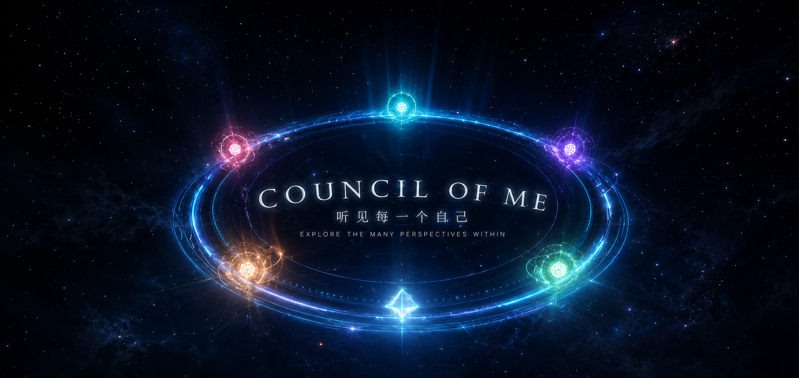
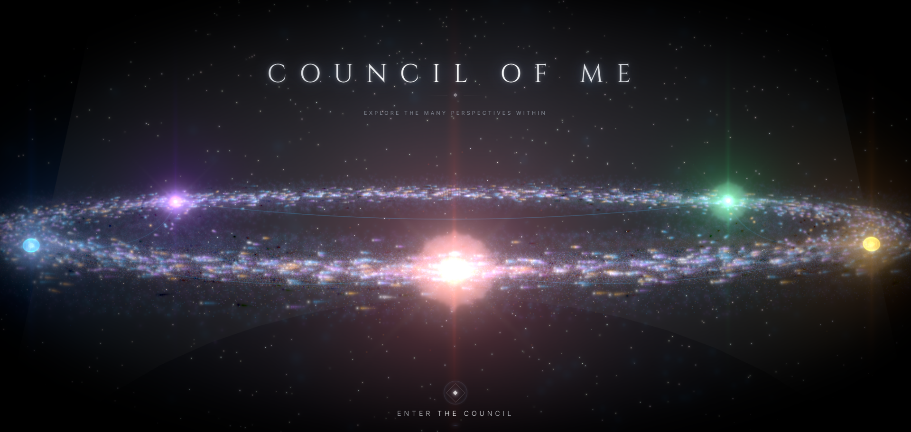
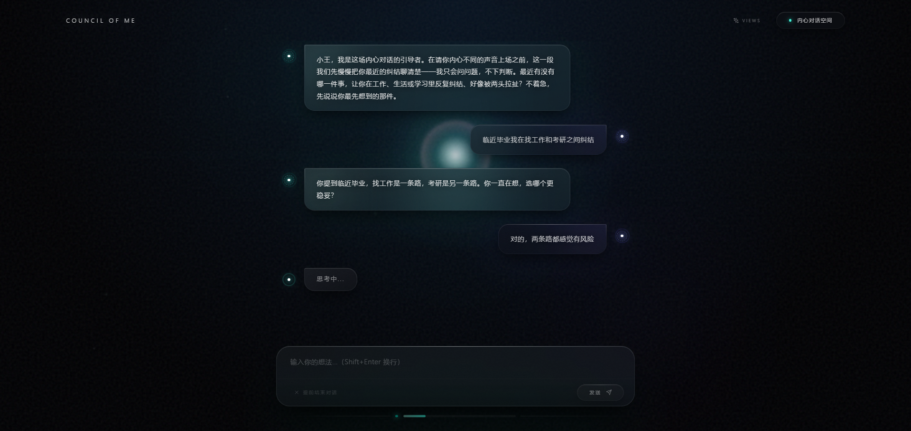
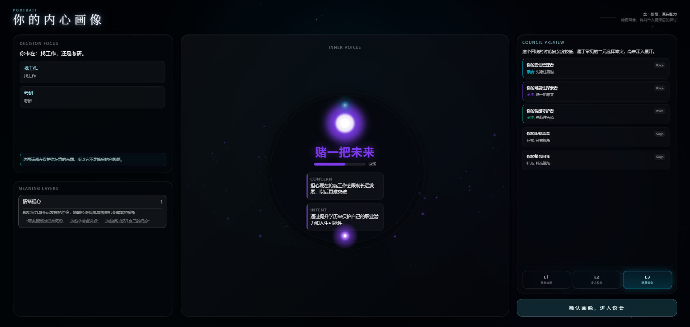
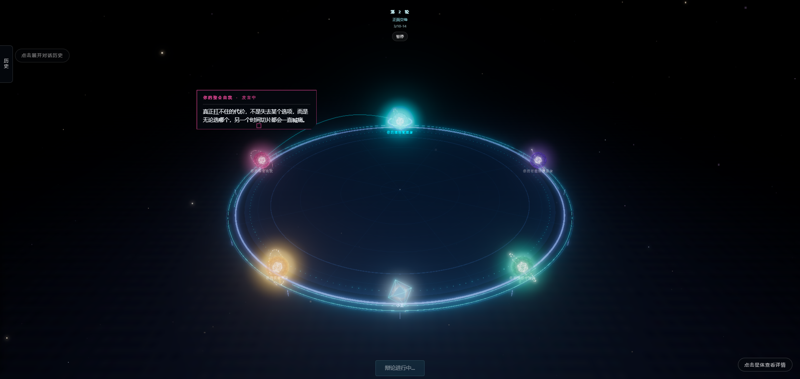
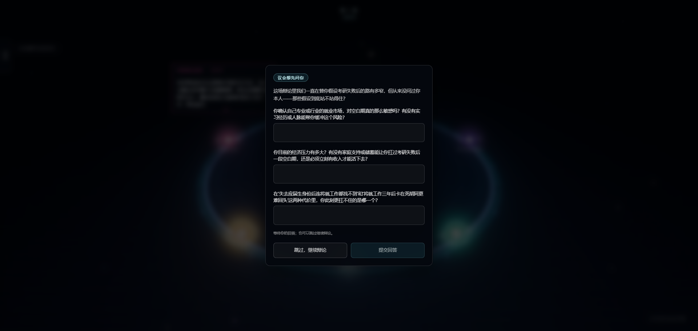
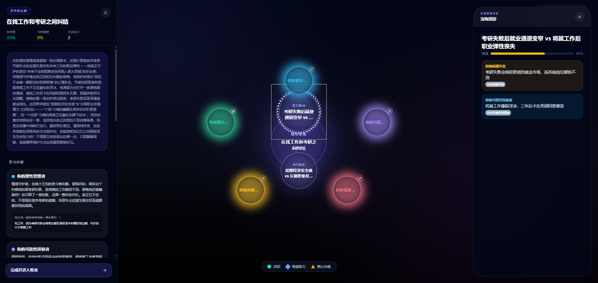

# The Council of Me · 内心议会



> 让代表你内心不同声音的 AI 角色，围绕你的困境**当面辩论**；你不下场、只旁观——最终拿到的不是一个答案，而是一张属于你的「内心冲突地图」。

## 一、这是什么

The Council of Me（内心议会）是一个**旁观式多 Agent 内心辩论**应用。

市面上的 AI 心理陪伴产品，几乎都是"一个 AI 给你一个建议"。这个项目反其道而行：把你的困境交给一屋子代表你不同内心声音的角色——**共情、理性、批判、创意、综合**——让它们当着你的面争，你坐在旁边看。



完整体验是一条流水线：

> **对话**（把乱麻理成冲突地图）→ **辩论**（内心声音当面交锋，全程实时流式直播）→ **综合图景**（张力星图）→ **内心画像**（你的多声部肖像）

两个关键立场贯穿始终：**你是旁观者，不是被建议者**；**终点是图，不是答案**。

## 二、想法的诞生

人在面对重大人生抉择（转行、关系、价值冲突）时，内心往往同时有好几个互相矛盾的声音在拉扯；这些声音通常是**隐性的、混乱的、难以自我觉察的**。

而现有 AI 心理健康工具（Woebot、Wysa、Replika……）几乎清一色是**单 Agent**：一个 AI、一种口吻、一条建议——恰恰抹平了"内心本就多声音"这个心理学基本事实。

于是有了这个项目的原始提问：

> 如果让多个 AI 分别代表你内心不同的"声音"，围绕你的困境辩论，而你以旁观者身份观看——这种"旁观式多 Agent 辩论"，能不能促成比"听一条建议"更深的自我反思？

The Council of Me 是对这个问题的一次完整回答：从心理学理论、交互设计到工程架构，每一层都为"旁观自己的内心"这件事服务。

## 三、心理学依据

这个项目不是"先做了产品再找理论贴金"——**每一个设计决策都能追溯到一条具体的心理学证据**。真正承重的是四个核心理论：前两个回答"内心为何是多声音的"，后两个回答"外化与旁观为何有效"。

**① 对话性自我理论（DST，Hermans 2001，被引 1,343+）**
自我不是单一的，而是多个"我位置"（I-positions）构成的"心灵的社会"，位置之间是对话关系；只有当每个位置被承认而非压制，对话才发生、自我才更新。
→ 每个角色 = 一个合法的"我位置"；辩论 = 我位置之间的对话；"不让任何声音垄断或沉默"直接落地为抢麦式发言治理。

**② 内在家庭系统（IFS，Schwartz 1995）**
心智由多个"部分"（parts）加一个核心"自我（Self）"组成；**所有部分都是善意的**，目标是部分间的和谐，而非消灭谁。
→ 角色 = 部分，**你本人 = Self**。"所有声音皆善意、不评判""给图不给答案、决定权始终在你"全部源于此。

**③ 自我距离化（Self-Distancing，Kross 2014，7 项研究 / N=585）**
用第三人称谈论自己的困境能创造"自我距离"，显著增强情绪调节、减少反刍——高强度负面情绪人群同样成立。
→ 你旁观角色们用第三人称讨论你的困境，正是自我距离化的产品化；对话阶段"不给建议、拉回感受"也以此为据。

**④ 多重自我：心理 + 计算双重验证（Suszek 2024 / Dulberg 2023, PNAS）**
心理侧：激活"多重自我模式"本身就能提升心理开放性与认知灵活性（d = 0.31–0.44，N=989）。计算侧：多个专门化模块组成的智能体，在复杂多变环境中优于单一整体智能体。
→ 一面证明"**仅仅展示多元视角，本身就是干预**"；一面证明"**多角色不是权宜之计，而是更优架构**"。

另有三根**支撑性支柱**，回答"如何把它做成促进反思的产品"：

- **反思性设计**：技术应促进反思而非效率——慢技术（可暂停、不催促）、陌生化与"有益不适"（批判审视者的理论来源）、Breakdown→Inquiry→Transformation、R0–R4 反思阶梯。
- **旁观式交互**：第三人称视角增强反思与自我慈悲；本项目取"**认知第三人称**"——无需 VR，在屏幕上看自己的内心被外化。
- **多智能体辩论**：多轮辩论提升推理（Du 2023）；选择性辩论深度 iMAD：token −92%、准确率 +13.5%（Fan 2025）；**多样性是辩论成功的主导因素**（Wu 2025）。

### 理论 → 设计 映射（节选）

| 设计元素 | 理论依据 |
|---|---|
| 多 Agent 代表不同声音 | DST 的 I-positions；IFS 的 parts；Dulberg PNAS 计算验证 |
| 用户旁观而非参与 | Kross 自我距离化；Döllinger 第三人称视角 |
| 内心冲突外化、可视化 | 内部言语外化；Pennebaker 表达性写作 |
| 展示多元视角本身即干预 | Suszek 多重自我（d=0.31–0.44） |
| 五角色（共情/理性/批判/创意/综合） | IFS 三类部分 + Self |
| 所有 Agent 皆善意、非评判 | IFS 核心态度；Hermans"所有 positions 被承认" |
| Agent 强制差异化 | Wu 2025 多样性主导；DST"每个 I-position 皆合法" |
| 批判审视者制造"有益冲突" | 陌生化（Bell 2005）；有益不适（Benford 2012） |
| 辩论深度按困境难度伸缩 | 选择性辩论 iMAD（Fan 2025） |
| 可暂停、不催促决策 | 慢技术（Hallnäs 2001） |

> 📚 完整理论支撑（4 核心理论 + 3 支柱 + 111 篇文献、论证链、关键数据速查）见：[项目理论支撑文档](https://ncnh636ueqjq.feishu.cn/docx/Io8fds1cTodqqcxxuVNcc0eYnSd)

## 四、它是怎么运作的

### 对话阶段：把乱麻理成「冲突地图」



难题：人在倾诉时含糊、防御、总想直接要答案；但辩论需要清晰素材。这一阶段的全部设计，都是**在不替你做决定的前提下，把内心冲突问清、问深、问全**。五个机制：

1. **循序渐进**——事实处境 → 各选择的代价与担忧 → "这对你意味着什么、你想成为谁"。三层递进，不一上来就掏心窝子。
2. **只用你的原话**——每次追问必须抓住你刚说过的一句话当落点；模型想脑补你没说过的情节，会被拦下重问。
3. **固定纠偏动作**——说空话→问实它；索要建议→不接茬，拉回两股力量各自在怕什么；只说一头→请你自己说出另一头，不代劳。
4. **换话题靠接不靠切**——先接住你这句，再自然带出下一条，绝不审讯式跳题。
5. **知道什么时候够了**——持续判断素材是否够撑起一场辩论，够了就主动收尾。

**产出**：一张冲突地图——几个内心声音（关切/恐惧/语气）、价值冲突、情绪、被牵动的人。

### 复杂度评估：你的困境值得多大的阵仗



冲突地图产出后，系统沿六个维度打分——**价值冲突强度、情绪浓度、可逆性、牵涉他人、显性深度、对话深度**——把困境分成三级，你在进入议会前可以亲眼确认这张画像：

| 级别 | 上场角色 | 最多轮次 | 适用 |
|---|---|---|---|
| L1 | 2 | 3 | 边界清晰的具体纠结 |
| L2 | 4 | 4 | 多重价值拉扯 |
| L3 | 5 | 5 | 不可逆的重大抉择 |

简单的事不小题大做，重大的事不草草收场——**算力和仪式感都随困境的重量伸缩**（iMAD 选择性辩论的产品化）。

### 辩论阶段：让内心声音当面吵给你看


难题：角色要吵得**有差异**（不能一个味儿）、不能**各说各话**（跑题）、不能**互相吹捧**（回声室），最后还得给**图**而不是**答案**。七个机制：

1. **角色 = 鲜明人设 × 你的一个具体声音**——五角色各有口头禅、禁语、语气甚至"体温"，再各自绑定冲突地图里的一个声音（如"理性分析者"挂上你那个"怕不稳定"的部分）。
2. **所有人吵同一条主线**——开辩前先立主线：核心矛盾 + 每个角色"最想护什么、最怕什么"，发给所有人。
3. **钻石式推进：先散后拢**——第一轮各自亮相且**互相不可见**（架构级防从众）；第二轮点名交锋；第三轮被怼后**校准而非和解**；最后收拢成图。
4. **抢麦而非排队**——被点名的优先反击、沉默的被拉进来、话多的被压一压，形成真实交锋节奏。



5. **三道防跑偏闸门**——人设漂移、报告腔/人身攻击、自我复读，任一触发即打回重说。
6. **议会会反过来问你**——当交锋建立在对你处境的**假设**之上时，议会会暂停，把最关键的几个问题递到你面前；你可以回答，也可以跳过继续旁观。**旁观是立场，不是禁令——Self 被邀请，而非被要求。**



7. **结尾给图不给答案**——综合者不站队，摆出核心张力、各方主张与共识地带。**决定权始终在你手里——你才是那个 Self。**



## 五、技术选型与架构

**技术栈**：后端 FastAPI（Python 3.11+）；前端 React + TypeScript + Vite，辩论现场用 **three.js（react-three-fiber + postprocessing）** 渲染；LLM 走 OpenAI 兼容接口，按**模型名前缀路由**到 DeepSeek 官方 / OpenAI 兼容 relay / 通义 / Claude relay。默认推荐 `deepseek-v4-flash`；无 Key 自动回退 mock。

**四段流水线 + 全程流式**：

```
对话 elicitation → 复杂度 complexity → 辩论 debate → 综合图景 synthesis → 内心画像 portrait
（旁路：reflection 反思 · closure 收束报告 · intervention 安全干预）
```

对话、辩论、综合、收束全部经 **SSE（Server-Sent Events）流式输出**——辩论是"直播"，不是"等报告"。

**后端分层**（`backend/app`）：

- **api/**：sessions · elicitation · debate · synthesis/portrait · complexity · intervention …
- **services/** 领域逻辑：
  - *对话*：`elicitation` · `tension_tracker`（张力两极追踪）· `intent_planner` + `elicitation_moves`（动作调度）· `depth_evaluator`
  - *辩论*（`debate/`）：`orchestrator`（编排）· `spine`（主线）· `round_evaluator`（轮次评审）· `exchange_budget`（抢麦预算）· `consistency`（三层人设一致性）· `repetition`（去重）· `language_rules`（语言闸）· `memory_manager`（双层记忆）· `termination`（收敛）· `model_router`（模型分层）
  - *产出*：`synthesis` · `portrait_composer` · `outcome_extractor` · `report`
  - *横切*：`llm`（统一调用）· `safety`（危机监测）· `turn_auditor`（话轮出口审计）· `embedding` · `file_store`（会话落盘）
- **eval/harness/**：运行时链路追踪与 LLM 调用观测（`trace_context` / `observer`）

**前端**（`frontend/src/pages`）：Welcome / Intro → Elicitation → Debate（三维议事厅）→ Synthesis（张力星图）→ Portrait → Reflection / Closure / History。

## 六、独特之处（设计 × 工程）

### 设计上

- **旁观而非参与**：你不是在和 AI 聊天，而是看自己的内心被外化、被辩论——认知第三人称，无需 VR。
- **给图不给答案**：终点是冲突地图。产品帮你看清，不替你决定。
- **产品即干预**：按多重自我研究，把多元视角摆出来这个动作本身就有心理价值，不必强求结论。
- **辩论是一个「场」，不是一个聊天列表**：three.js 渲染的暗色议事厅、围坐的声部、实时字幕与立场卡——氛围本身在告诉你"这是一场关于你的严肃审议"，而不是又一个客服窗口。
- **仪式感随困境伸缩**：小纠结两个声音三轮就收，重大抉择五声部辩满五轮——不对小事过度戏剧化，不对大事敷衍了事。
- **安全不是免责声明**：内置危机监测，且刻意区分"直接危机信号"与"高强度痛苦表达"——后者不触发干预（避免把正常的激烈情绪当病），前者立即弹出求助资源。倾诉类产品里，**不误伤**与**不漏接**同样重要。

### 工程上 —— ⭐ 快模型 + 强 harness，可能比强模型更好

本项目最核心的工程主张：**与其堆一个更大更强的模型，不如把一个又快又便宜的模型（`deepseek-v4-flash`）包进一套强壮、确定性、可回归的工程护栏里。** 具体做法分五层：

**① 贵的算力只花在刀刃上（`ModelRouter`）**
任务分两档：需要表达力的（角色发言、张力抽取、投入度评估、收敛映射）走主模型；机械的结构化抽取（元信息、一致性检查、立场抽取、演化追踪）走辅助档。

**② 质量靠确定性护栏，不靠模型自觉**
- `spine` 强制全场围绕同一核心矛盾；第一轮互不可见，从架构上防从众；
- `exchange_budget` 抢麦预算治理"懒惰 / 沉默 / 垄断"；
- `consistency` 用 **embedding 余弦相似度**做三层人设一致性检查（人设→发言、发言→历史发言），无 embedding 模型时优雅降级为关键词启发式——**人设漂移是算出来的，不是感觉出来的**；
- `repetition` 拦自我复读，`language_rules` 拦报告腔与人身攻击，`turn_auditor` 对候选话轮做与话题无关的出口审计——任一触发即打回重说，**自愈而非崩坏**。

**③ 角色有记忆，坚持才有分量**
`memory_manager` 给每个角色配**私有记忆**（我说过什么、我坚持什么）+ 全场**共享记忆**（争到哪了）。被怼后的"校准而非和解"，靠的是角色真的记得自己上一轮站在哪。

**④ 降级时抢救模型自己的话，而不是回退到罐头模板**
早期版本在输出不合格时回退到固定模板句——结果每轮都长一个样。现在的 `_salvage_degraded_output` 反其道而行：从模型的原始输出里**抢救出它自己提出的那个真问题**，只在完全没有问题可救时才用最小兜底。代码注释里的原话：*"a real question beats a canned template."*
这条弯路给出的教训值得写在这里：**该加固的是确定性层的策略，而不是无限地修 prompt。**

**⑤ 质量是测出来的，不是感觉出来的**
开发全程用录像回放 + 指标基线做回归：对话与辩论的整场记录被量化为一组质量旗标（复读率、层级跃迁、结构套话密度……），每次提示词或策略改动都对着基线跑——防止"改好了这里、坏了那里"的暗回归。

> 一句话总结：**把稳定性做进工程，而不是买进模型。** 小快模型的抖动由确定性护栏兜住，省下的成本和延迟换来可验证、可回归的体验质量。

### 顺带一提：优雅降级贯穿全栈

无 LLM Key → mock 回复照样跑通全流程；无 embedding 模型 → 一致性检查降级为启发式；无 Postgres → 内存 + 文件落盘（`file_store` 原子写，每阶段产物皆为可检查的 JSON）。**克隆下来 `uvicorn` 一条命令就能看到完整产品形态，配置是增强项而不是入场券。**

## 七、使用说明

### 环境要求

- 后端：Python 3.11+
- 前端：Node.js 18+
- 一个 OpenAI 兼容的 LLM API Key（推荐 DeepSeek 官方；不配也能以 mock 模式体验流程）

### 1）启动后端

```bash
cd backend
python -m venv .venv
# Windows: .venv\Scripts\activate   |   macOS/Linux: source .venv/bin/activate
pip install -r requirements.txt
cp ../.env.example ../.env          # 然后填入你的 Key
uvicorn app.main:app --reload
```

API 默认在 `http://127.0.0.1:8000`。

### 2）配置 LLM（推荐 ds v4 flash）

编辑 `.env`：

```ini
LLM_PROVIDER=openai
LLM_MODEL=deepseek-v4-flash        # ← 推荐：快、省，配合强 harness 效果佳
LLM_WIRE_API=chat_completions
DEEPSEEK_API_KEY=你的_key
DEEPSEEK_BASE_URL=https://api.deepseek.com
LLM_MAX_TOKENS_DEFAULT=4096        # ≤ DeepSeek 官方单次输出上限 8192
```

### 3）启动前端

```bash
cd frontend
npm install
npm run dev          # 开发服务器，/api 自动代理到 127.0.0.1:8000
npm run build        # 生产构建
```

### 4）体验路径

打开前端 → **对话**：把困境说给访谈者 → 系统评估复杂度、生成**冲突地图**并让你确认**内心画像** → 旁观内心声音的**辩论**（实时流式，议会偶尔会反过来问你）→ 得到**综合图景**（张力星图）→ 可继续**反思对话**或下载**收束报告**。

## 八、理论与文献

- **完整理论支撑**（4 核心理论 + 3 支柱 + 111 篇文献、理论→设计映射、论证链、关键数据）：[项目理论支撑文档](https://ncnh636ueqjq.feishu.cn/docx/Io8fds1cTodqqcxxuVNcc0eYnSd)
- **关键参考**：Hermans 2001 (DST) · Schwartz 1995 (IFS) · Kross 2014 (自我距离化) · Suszek 2024 (多重自我) · Dulberg 2023 (PNAS) · Du 2023 / Fan 2025 (iMAD) / Wu 2025 (辩论多样性) · Sengers 2005 / Baumer 2015 / Fleck 2010 (反思性设计)
